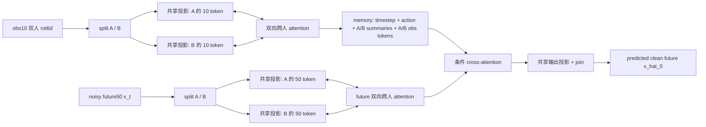

# NTU 双人显式跨人 attention 架构设计

## 状态

这是待实现、待验证的架构设计，不包含训练结果。它不能替代已有 diffusion 排查中的首帧不连续、自由采样分布不一致、`L_inter` 尺度失衡和 rot6d 回归问题。

## 问题

当前 diffusion 的每个时间帧先将双人 canonical rot6d `[56,12]` 压平为 `672` 维，再执行 `Linear(672,256)`：

```text
[B,56,12,T] -> [T,B,672] -> [T,B,256]
```

因此 obs encoder 只有 `obs_len=10` 个双人时间 token；future decoder 只有 `pred_len=50` 个双人时间 token。self-attention 可以在时间上比较“第 i 帧的双人整体”和“第 j 帧的双人整体”，但没有 `Person A(t)` 与 `Person B(s)` 分开的 key/value。两人的局部信息在第一次线性投影前即被压缩，无法要求模型显式学习跨人对应关系。

相同瓶颈也存在于 `model/forecasting_ntu_xyz.py`：它将 `[B,T,2,55,3]` 压平为每帧一个 `330` 维双人 token。

## 设计目标与边界

目标是把“个人自身的时序建模”和“跨人的信息读取”分成明确的数据路径，同时保持 A/B 参数共享，避免仅靠增加参数量获得收益。

不把本设计写成“关系建模必然提升指标”的结论。当前 diffusion 未过主 gate 的直接证据仍是采样和连续性问题；显式跨人 attention 是一个独立、可证伪的架构假设。

## 推荐架构

### 1. 双人分 token，而不是双人合并 token

复用已有 `split_ntu_2p_rot6d`：

```text
[B,56,12,T]
  -> Person A [B,56,6,T]，Person B [B,56,6,T]
  -> 每人每帧压平为 336 维
  -> 共享 Linear(336,256)
  -> [T,B,2,256]
```

两个分支共享输入/输出投影和时序模块的参数。A/B 是数据槽位而不是固定的人物身份；不建议先加入独立的 A/B 身份 embedding，以免在 `person_a_then_person_b_assumed` 的顺序上过拟合。两个分支本身已经保留了“自己/对方”的方向。

同一时间的 A、B token 加相同时间位置编码；它表达两人处于同一时刻。观测、future、timestep、action 仍使用不同 token type 标识。

### 2. Obs 显式交互编码器

用 `obs_encoder_layers=2` 个共享的 `TwoPersonInteractionEncoderLayer` 替代当前单一 `TransformerEncoder`。每层顺序为：

```text
H_A, H_B: [10,B,256]
  -> 对每个人独立且共享参数的 temporal self-attention
  -> A 查询 B 的全 10 帧：CrossAttention(Q=A, K/V=B)
  -> B 查询 A 的全 10 帧：CrossAttention(Q=B, K/V=A)
  -> 各自 residual + LayerNorm + FFN
```

`A(t)` 可对所有 `B(1..10)` 分配权重，而不仅是 `B(t)`；这允许模型学习同步互动和带时间滞后的反应。两个方向调用同一组 cross-attention 参数，保证交换 A/B 后结构仍保持对称。

输出为 20 个保留来源的观测 token：

```text
H_A^out [10,B,256]，H_B^out [10,B,256]
```

这一步是显式的 `Person A <-> Person B` attention，区别于把两人合并成一个向量后再做时间 self-attention。

### 3. Memory 保持可查询的双人历史

建议用 24 个 memory token：

```text
1 timestep token
1 action token
1 Person A history summary = mean(H_A^out)
1 Person B history summary = mean(H_B^out)
10 Person A contextual history tokens
10 Person B contextual history tokens
```

每个 contextual token 已经过一次对方历史的 cross-attention，但仍保留自己的时间位置和来源。不要把 20 个 token 再平均成单个“双人摘要”，否则会重新制造信息瓶颈。

### 4. Future 双人去噪 decoder

`x_t` 必须同样拆成两人；只改 obs path 而保留 future 单 token，仍会让 decoder 以“一个双人整体”表示当前去噪状态。

```text
x_t [B,56,12,50]
  -> split
  -> shared Linear(336,256)
  -> H_A^future, H_B^future: [50,B,256]
```

用 4 个 `TwoPersonForecastingDecoderLayer` 替代当前 `nn.TransformerDecoder`。每层执行：

```text
1. A、B 各自在自己的 future50 内做 temporal self-attention。
2. A 查询 B 的 future50，B 查询 A 的 future50。
3. A、B 各自以其 future token 查询 24 个条件 memory token。
4. 各自 residual + LayerNorm + FFN。
```

第 2 步使当前去噪状态里的两人显式交换信息；第 3 步让每个人按需读取两人 obs 历史、动作标签和扩散 timestep。保留 `causal_future_mask=False`，因为扩散去噪不是自回归生成，future50 的 token 应可联合恢复整条轨迹。

最后以共享 `Linear(256,336)` 分别映射 A/B future token，再复用 `join_ntu_2p_rot6d` 回到原评估接口：

```text
[50,B,2,256] -> [B,56,12,50]
```

## 架构图



## 修改边界

主要实现位置为 `model/forecasting_ntu_2p_diffusion.py`：

1. 以新的双人 token 投影替换 `obs_input_process`、`future_input_process` 和 `output_process`。
2. 增加可复用的双人 temporal/cross-person attention layer；推荐新建 `model/two_person_transformer.py`，避免把自定义 attention 堆入模型入口。
3. 用双人 obs 输出重建 memory，不再使用单个 `obs_summary` 与 10 个混合 obs token。
4. 用双人 decoder layer 取代 `seqTransDecoder`，并在 config/checkpoint 中新增架构类型和层数记录。
5. 复用现有 `split_ntu_2p_rot6d`、`join_ntu_2p_rot6d`，不改数据集格式、SMPL-X 转换或 paired xyz 评估口径。

训练端的 `q_sample`、`START_X` target 和 `L_inter` 不因 token 化本身而改变；但应与已记录的连续性/采样/损失尺度修复分开消融，不能把多个原因混为“跨人 attention 的收益”。

## 推荐验证顺序

1. 先在 direct joint xyz Transformer 中做同样的双人 token + 双向 cross-attention 版本。该模型没有 DDIM 采样干扰，且当前 joint xyz 已略超过独立单人 baseline，最适合验证关系模块的净贡献。
2. 固定数据、seed、训练步数和近似参数量，对比三组：旧双人 concat token、双人 token 但关闭跨人 attention、双人 token 且开启跨人 attention。只有第三组相对第二组的增益才能归因于跨人路径。
3. 对验证集按 `xyz_mse/xyz_mae/mpjpe` 选择配置，冻结后只做一次 test。主 gate 仍是同时超过 independent single-person baseline：`0.0490373378 / 0.1152569476 / 0.2441592532`。
4. 只有上述消融证明跨人模块有净收益，才将同一模块迁入 diffusion；迁入时还必须采用独立的首帧连续性、自由采样和 `L_inter` 尺度修复协议。

## 必要测试

- `split -> shared projection -> output projection -> join` 的形状和有限值检查。
- 双向 cross-attention 开启时，改变 B 的 obs 应可改变 A 的条件输出；关闭该模块时，该跨人依赖不得通过其他混合路径泄漏。
- 交换 A/B 输入后，输出也应相应交换的等变性检查，至少在关闭 slot identity embedding 的设计下成立。
- CUDA 训练强制使用 `cuda:0`，不得回退 CPU。
- 参数量、显存、每 step 耗时与旧模型一并记录，避免将更大容量误判为关系模块贡献。
