# NTU 双人显式跨人 attention 新版模型架构详细设计

## 文档状态

- 状态：设计规格，尚未实现。
- 实验结果：暂无，不能把本设计写成已验证的性能提升。
- 目标模型：NTU120 双人 `obs10 -> future50` 的 ReGenNet 风格条件 diffusion。
- 主比较 gate：paired xyz 的 `xyz_mse`、`xyz_mae`、`mpjpe` 同时超过 independent single-person xyz baseline。
- 已知前置问题：当前 diffusion 还存在自由 DDIM 采样与训练目标不完全对齐、首帧连续性未约束、`L_inter` 尺度过强和 rot6d 回归误差；这些问题必须与跨人 attention 分开处理和消融。

## 1. 改造动机

当前模型在 `model/forecasting_ntu_2p_diffusion.py` 中把每个时间帧的双人数据先拼成一个向量：

```text
双人 canonical rot6d 一帧：[56,12]
压平：                 56*12 = 672
输入投影：             Linear(672,256)
结果：                 一个双人时间 token [256]
```

因此 obs encoder 实际看到的是：

```text
Person A+B at frame 1 ↔ Person A+B at frame 2 ↔ ... ↔ Person A+B at frame 10
```

它没有独立的 `Person A token` 和 `Person B token`，所以 self-attention 不能显式计算：

```text
Person A(t) ↔ Person B(s)
```

同一个信息瓶颈也存在于 noisy future：future decoder 的每个 token 仍是一个双人整体。只改 obs encoder 而保留 future 单 token，会让生成阶段继续缺少明确的 A/B 交互路径。

## 2. 旧版与新版结构对照

| 部分 | 当前旧版 | 新版设计 |
|---|---|---|
| 单帧输入投影 | `Linear(672,256)`，双人先合并 | 先拆 A/B，各自 `Linear(336,256)` |
| obs token 数 | 10 个双人 token | A 10 个 + B 10 个 |
| obs 建模 | 10 个 token 的时间 self-attention | 每人 temporal self-attention + A↔B cross-attention |
| obs memory | 1 个混合 summary + 10 个混合 token，共 13 | A/B 各自 summary + A/B 各 10 个 token，加 timestep/action，共 24 |
| future token | 50 个双人 token | A 50 个 + B 50 个 |
| future 建模 | 标准 TransformerDecoder | 每人 temporal self-attention + future A↔B cross-attention + memory cross-attention |
| 输出 | `Linear(256,672)` 后直接 reshape | A/B 共享 `Linear(256,336)`，再 `join_ntu_2p_rot6d` |
| 关系损失 | 输出端 `L_inter`，不创建 attention 路径 | 保留 `L_inter`，另加显式中间交互路径 |

## 3. 输入表示与人物拆分

模型接口和数据格式不变：

```text
obs_motion：[B,56,12,10]
x_t：      [B,56,12,50]
```

使用已有 `utils/ntu_2p_rot6d.py` 中的 `split_ntu_2p_rot6d`：

```text
Person A：[B,56,6,T]
Person B：[B,56,6,T]
```

其中每个人的一帧压平维度为：

```text
56 个位置 × 6 维 = 336 维
```

A/B 使用相同的输入投影和输出投影参数：

```text
Linear(336,256)  # A、B 共用
```

共享参数是必要的，否则新增收益可能来自人物专属参数量，而不是来自跨人关系建模。

默认不加入固定的 A/B 身份 embedding。这样交换 A/B 输入时，结构有机会实现对应交换的输出；是否加入 `person_role` embedding 作为额外消融，而不是默认设计。

## 4. Obs Interaction Encoder

### 4.1 输入

```text
A obs tokens：[10,B,256]
B obs tokens：[10,B,256]
```

两条流使用同一套时间位置编码，表示 A 和 B 的 token 位于同一时间轴；另用 token type 区分 obs frame、summary、timestep 和 action。

### 4.2 单层结构

设计 `TwoPersonInteractionEncoderLayer`，共堆叠 2 层。每层包含：

```text
输入 H_A、H_B
  ↓
1. A temporal self-attention：A(1..10) 内部建模
2. B temporal self-attention：B(1..10) 内部建模
  ↓
3. A ← B cross-attention：Q=A，K/V=B
4. B ← A cross-attention：Q=B，K/V=A
  ↓
5. 各自 FFN、Residual、LayerNorm
输出 H_A'、H_B'
```

双向 cross-attention 使用共享参数：同一个 attention 模块分别执行 `A <- B` 和 `B <- A`，避免因方向不同引入不必要的参数翻倍。

### 4.3 它实际学习什么

对于 A 的第 `t` 帧，cross-attention 可以读取 B 的全部历史：

```text
A(t) 查询 B(1), B(2), ..., B(10)
```

注意力权重由模型训练得到，没有人工规定某个 head 必须负责“距离”或“接触”。模型可以学习同步动作、滞后反应、相对位置变化等关系，但是否真的学到这些关系必须用消融和输入依赖测试验证。

输出仍保持人物来源：

```text
H_A：[10,B,256]
H_B：[10,B,256]
```

不会把 A/B 再平均回一个双人 token。

## 5. 条件 memory

新版 memory 由 24 个 token 组成：

```text
1  timestep token       [1,B,256]
1  action token         [1,B,256]
1  A history summary    [1,B,256]
1  B history summary    [1,B,256]
10 A contextual tokens  [10,B,256]
10 B contextual tokens  [10,B,256]
--------------------------------
总计                    [24,B,256]
```

其中：

```python
A_summary = H_A.mean(dim=0, keepdim=True)
B_summary = H_B.mean(dim=0, keepdim=True)
```

摘要只是额外提供全局条件，A/B 的 20 个逐帧 token 仍然保留。memory 中执行 `LayerNorm + Linear(256,256)`，不沿 token 维度做再次平均。

## 6. Future Interaction Decoder

### 6.1 输入

训练时：

```text
真实 future x₀：[B,56,12,50]
q_sample       → noisy future x_t：[B,56,12,50]
```

推理时：

```text
DDIM 当前状态 x_t：[B,56,12,50]
```

两者都使用同一拆分和投影：

```text
x_t
  → split A/B
  → A/B 各自 Linear(336,256)，共享参数
  → A future tokens：[50,B,256]
  → B future tokens：[50,B,256]
```

future token 加完整窗口中的时间位置编码 `obs_len ... obs_len+pred_len-1`，并加 `future_type`，表示它们是待去噪的 future token。

### 6.2 单层结构

设计 `TwoPersonForecastingDecoderLayer`，共堆叠 4 层。每层包含：

```text
输入 F_A、F_B、memory
  ↓
1. A future temporal self-attention：A 的 50 帧彼此交流
2. B future temporal self-attention：B 的 50 帧彼此交流
  ↓
3. A future ← B future cross-attention
4. B future ← A future cross-attention
  ↓
5. A/B future 分别查询 memory 的条件 cross-attention
  ↓
6. 各自 FFN、Residual、LayerNorm
输出 F_A'、F_B'
```

这里的 future self-attention 默认不使用 causal mask：扩散去噪是联合恢复整段 future50，不是逐帧自回归生成。每个 future token 可以同时读取其他未来帧和双人条件 memory。

## 7. 输出路径

decoder 输出：

```text
A decoded tokens：[50,B,256]
B decoded tokens：[50,B,256]
```

使用共享输出投影：

```text
Linear(256,336)  # A、B 共用
```

再将 A/B 重新拼回原接口：

```text
[50,B,2,336]
  → join_ntu_2p_rot6d
[B,56,12,50]
```

在当前 diffusion 配置中，这个输出表示模型对干净 future 的估计：

```text
x_hat_0：[B,56,12,50]
```

它不是噪声 `epsilon`，也不是直接的 `x_{t-1}`；DDIM 再根据 `x_hat_0` 和当前 `x_t` 计算下一个采样状态。

## 8. 完整架构图

```mermaid
flowchart LR
    subgraph DATA[双人输入]
        OBS["obs10 rot6d<br/>[B,56,12,10]"]
        FUT["noisy future x_t<br/>[B,56,12,50]"]
    end

    subgraph OBSENC[Obs Interaction Encoder x2]
        OS["split A / B"]
        OPA["共享输入投影 A<br/>Linear(336,256)"]
        OPB["共享输入投影 B<br/>Linear(336,256)"]
        OA["A obs tokens<br/>[10,B,256]"]
        OB["B obs tokens<br/>[10,B,256]"]
        OSA["A temporal self-attention"]
        OSB["B temporal self-attention"]
        OAB["A <- B cross-attention"]
        OBA["B <- A cross-attention"]
        OSA --> OAB
        OSB --> OBA
        OAB --> OOUTA["A contextual obs<br/>[10,B,256]"]
        OBA --> OOUTB["B contextual obs<br/>[10,B,256]"]
    end

    OBS --> OS
    OS --> OPA --> OA --> OSA
    OS --> OPB --> OB --> OSB

    TIME["timestep token<br/>[1,B,256]"]
    ACTION["action token<br/>[1,B,256]"]
    ASUM["A summary<br/>[1,B,256]"]
    BSUM["B summary<br/>[1,B,256]"]
    MEM["双人 memory<br/>24 tokens × [B,256]"]

    OOUTA --> ASUM --> MEM
    OOUTB --> BSUM --> MEM
    OOUTA --> MEM
    OOUTB --> MEM
    TIME --> MEM
    ACTION --> MEM

    subgraph FUTDEC[Future Interaction Decoder x4]
        FS["split A / B"]
        FPA["共享 future 投影 A<br/>Linear(336,256)"]
        FPB["共享 future 投影 B<br/>Linear(336,256)"]
        FA["A future tokens<br/>[50,B,256]"]
        FB["B future tokens<br/>[50,B,256]"]
        FSA["A future temporal self-attention"]
        FSB["B future temporal self-attention"]
        FAB["A future <- B future"]
        FBA["B future <- A future"]
        CM["future -> memory<br/>conditional cross-attention"]
        DA["A decoded tokens<br/>[50,B,256]"]
        DB["B decoded tokens<br/>[50,B,256]"]
        FSA --> FAB --> CM --> DA
        FSB --> FBA --> CM --> DB
    end

    FUT --> FS
    FS --> FPA --> FA --> FSA
    FS --> FPB --> FB --> FSB
    MEM --> CM

    OUTA["共享输出投影 A<br/>Linear(256,336)"]
    OUTB["共享输出投影 B<br/>Linear(256,336)"]
    JOIN["join A/B rot6d"]
    XHAT["预测干净 future x_hat_0<br/>[B,56,12,50]"]

    DA --> OUTA --> JOIN
    DB --> OUTB --> JOIN
    JOIN --> XHAT

    LDM["L_dm<br/>x_hat_0 vs x_0"]
    LINTER["L_inter<br/>joint / orient / trans"]
    XHAT --> LDM
    XHAT --> LINTER

    DDIM["DDIM 更新<br/>推理时得到下一状态 x_tnext"]
    XHAT --> DDIM
    DDIM -. "下一轮输入，timestep 降低" .-> FUT
```



## 9. 与 diffusion 训练、采样的关系

跨人 token 化不改变 diffusion 的基本接口：

```text
训练：x₀ → q_sample → x_t → 模型 → x_hat_0
推理：x_T → 模型 → x_hat_0 → DDIM → x_tnext → 重复
```

它也不改变 `START_X` 的目标定义：`L_dm` 仍比较模型输出和干净目标 `x₀`。`L_inter` 仍在输出转换后的双人几何上计算 joint、orientation 和 translation 关系项。

但是，跨人 attention 不能自动解决以下问题：

1. DDIM 自由采样与训练时 `q_sample(real_future,t)` 的分布差异；
2. 第一预测帧没有强制等于 obs 最后一帧；
3. `L_inter` 三个子项和 `L_dm` 的尺度未校准；
4. rot6d 预测列不严格位于合法旋转流形。

这些因素必须独立设计 ablation，不能把最终指标变化全部归因于跨人 attention。

## 10. 代码修改边界

### 10.1 新增模块

建议新增：

```text
model/two_person_transformer.py
```

模块至少包含：

```text
TwoPersonInteractionEncoderLayer
TwoPersonInteractionEncoder
TwoPersonForecastingDecoderLayer
TwoPersonForecastingDecoder
```

模块内部只处理 token attention，不负责 NTU 数据拆分和 rot6d join，保持数据表示逻辑与 attention 逻辑分离。

### 10.2 diffusion 模型入口

修改：

```text
model/forecasting_ntu_2p_diffusion.py
```

主要变化：

1. 用 A/B 共享单人投影替换 `InputProcess(672,256)`。
2. 用双人 obs interaction encoder 替换当前 `self.obs_encoder`。
3. 用 A/B summary + A/B contextual tokens 重建 memory。
4. 用双人 future interaction decoder 替换当前 `nn.TransformerDecoder`。
5. 用共享 A/B 输出投影和 `join_ntu_2p_rot6d` 还原旧输出 shape。
6. 在 `config()` 中记录新架构名称、cross-person attention 开关和 token 数，确保 checkpoint 可复现。

### 10.3 先做 direct xyz 验证

建议先在：

```text
model/forecasting_ntu_xyz.py
```

实现等价的 A/B token 和双向 cross-attention 版本。原因是 direct xyz 没有 DDIM 多步自由采样链路，能够直接验证“显式跨人 attention 是否有净收益”。通过后再迁入 rot6d diffusion。

## 11. 必须进行的消融

至少固定相同数据、seed、训练步数、优化器和近似参数量，比较：

| 配置 | A/B 分 token | A↔B attention | 用途 |
|---|---:|---:|---|
| Joint concat | 否 | 否 | 当前旧版基线 |
| Separate token | 是 | 否 | 判断仅拆 token 的收益 |
| Explicit interaction | 是 | 是 | 判断跨人 attention 的净收益 |
| Separate + asymmetric params | 是 | 是 | 风险对照，不作为公平主结果 |

只有第三组相对第二组的改进，才能支持“显式跨人 attention 有贡献”的判断。所有组都必须同时报告：

```text
xyz_mse
xyz_mae
mpjpe
first_step_error
参数量
显存与每 step 耗时
```

主 gate 继续使用 independent single-person baseline：

```text
xyz_mse = 0.0490373378
xyz_mae = 0.1152569476
mpjpe   = 0.2441592532
```

## 12. 必要单元和行为测试

1. `split -> shared projection -> output projection -> join` 形状、有限值和 round-trip 检查。
2. 修改 B 的 obs 后，开启 cross-person attention 时 A 的 contextual token 必须发生变化。
3. 关闭 cross-person attention 且保持其他路径不混合时，修改 B 不应改变 A 的独立编码结果。
4. 交换 A/B 输入，输出应按人物维度对应交换；如果加入 `person_role` embedding，必须单独报告等变性变化。
5. 检查 `obs_len=10`、`pred_len=50` 下每层 token shape 不变。
6. 在 `cuda:0` 上完成 forward、反向和小 batch smoke，禁止静默回退 CPU。
7. 记录参数量和显存，避免把单纯容量增加误判为交互建模收益。

## 13. 预期收益与风险

预期收益是让模型拥有明确的两条关系路径：

```text
obs A(t) ↔ obs B(s)
future A(t) ↔ future B(s)
```

主要风险：

- future token 从 50 个增加为 100 个，decoder 显存和计算量上升；
- 双向 cross-attention 可能放大错误的远距离对应关系；
- 没有参数量控制时，提升可能只是模型变大；
- rot6d diffusion 的采样失配问题仍可能掩盖关系模块的收益；
- 如果动作标签本身不能区分互动状态，attention 具备关系通道也不等于一定能学出稳定的互动轨迹。

## 14. 当前结论

新版架构的核心修改不是“把 10 个 token 变成 20 个 token”，而是：

```text
双人合并投影
  → 共享单人投影
  → 人物内 temporal self-attention
  → 人物间双向 cross-attention
  → 分人物输出并 join
```

该结构为显式关系建模提供了必要的数据路径，但性能收益必须通过参数量受控的三组消融和 paired xyz 主指标验证。当前文档仅定义结构，不代表模型已经实现或超过 baseline。
